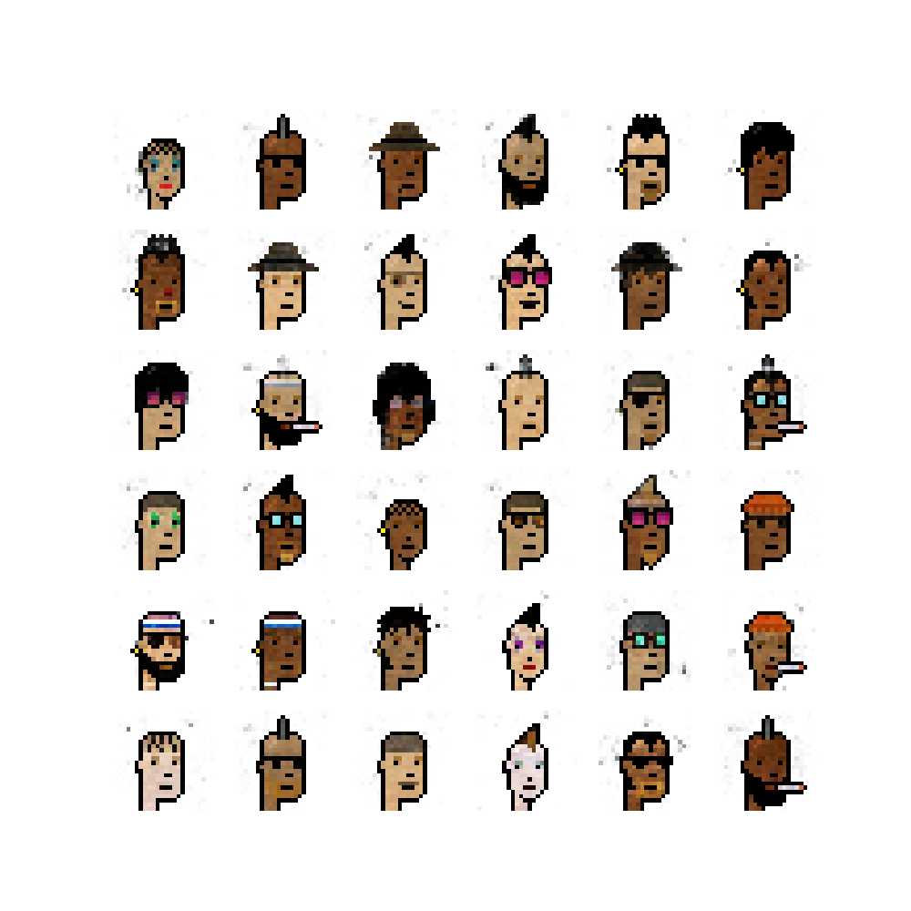

# CryptoGANs
This is a simple TensorFlow implementation of a DCGAN to generate CryptoPunks



> CryptoPunks generated by this work

This repository was created during the HuggingFace's [HugGAN sprint](https://github.com/huggingface/community-events/tree/main/huggan), so you can also checkout this work's results at its [HuggingFace hub entry](https://huggingface.co/huggan/crypto-gan) and [HuggingFace sapce](https://huggingface.co/spaces/huggan/crypto-gan)


# Usage

## Train

## Inference using Gradio

### Using model from HuggingFace hub
This will download the generator model from HuggingFace hub and serve it.
```bash
python3 hf_app.py
```

### Using your own model
This requires you to have a `models` folder at root with a generator model.
```bash
python3 app.py
```

# Notes

# References
- [CryptoPunks GAN](https://github.com/teddykoker/cryptopunks-gan)
- [Deep Convolutional Generative Adversarial Network](https://www.tensorflow.org/tutorials/generative/dcgan)

# TODO list
- [ ] Create train script.
- [ ] Update notebooks to use this repository as reference.
- [ ] Update [HF model card]((https://huggingface.co/huggan/crypto-gan)).
- [ ] Improve model, it needs to generate more diverse punks.
- [ ] Do better data sampling with TFDataset (might need to move out from TFDatasets).
- [ ] Integrate pre_processing and post_processing into the TF model graph