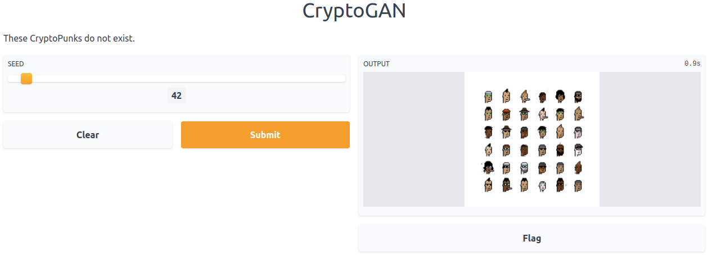
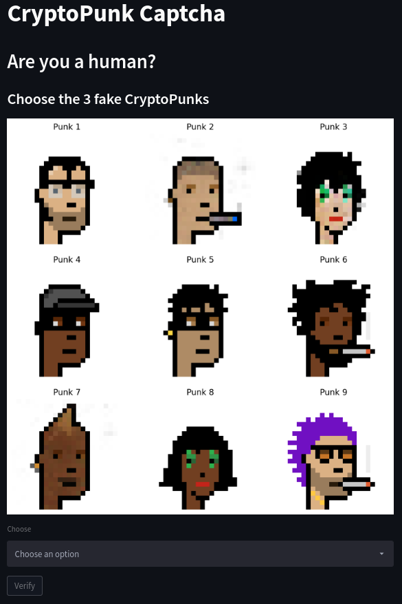

# CryptoGANs
This is a simple TensorFlow implementation of a DCGAN to generate CryptoPunks


> CryptoPunks generated by this work

This repository was created during the HuggingFace's [HugGAN sprint](https://github.com/huggingface/community-events/tree/main/huggan). You can also checkout its related entries:
- [Model card (HF hub)](https://huggingface.co/huggan/crypto-gan)
- [CryptoPunks generation (HF space)](https://huggingface.co/spaces/huggan/crypto-gan)
- [CryptoPunk Captcha (HF space)](https://huggingface.co/spaces/huggan/cryptopunk-captcha)


# Usage

## Train
This script will train your models from scratch, but ir requires a `data/images` folder at root will the CryptoPunks images.
```bash
python3 train.py
```

## Gradio App (CryptoPunk generation)



### Using your own model
This requires you to have a `models` folder at root with a generator model.
```bash
python3 app.py
```

### Using a model from HuggingFace hub
This will download the generator model from HuggingFace hub and serve it.
```bash
python3 hf_app.py
```

## Streamlit App (CryptoPunk Captcha)


### Using your own model
This requires you to have a `models` folder at root with a generator model.
```bash
streamlit run captcha_app.py
```

### Using a model from HuggingFace hub
This will download the generator model from HuggingFace hub and serve it.
```bash
streamlit run hf_captcha_app.py
```

# References
- [CryptoPunks GAN](https://github.com/teddykoker/cryptopunks-gan)
- [Deep Convolutional Generative Adversarial Network](https://www.tensorflow.org/tutorials/generative/dcgan)